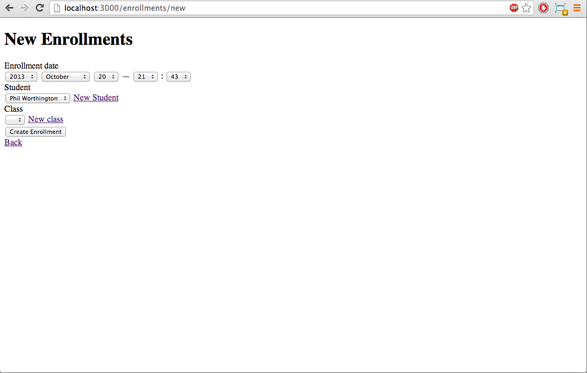

# Enrollments
<!-- If you'd like to use a logo instead uncomment this code and remove the text above this line

  

-->

By [Phil Worthington](https://github.com/philworthington).

## Description
This is a simple rails app using the 'has many: through' relationship to join students to classes through enrollments.

## Information

Screenshots of your application below:

## Authors

* Phil Worthington (https://github.com/philworthington)

## Contributing

1. Fork it
2. Create your feature branch (`git checkout -b my-new-feature`)
3. Commit your changes (`git commit -am 'Add some feature'`)
4. Push to the branch (`git push origin my-new-feature`)
5. Create new Pull Request

